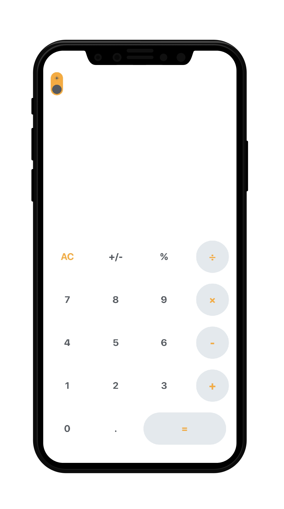
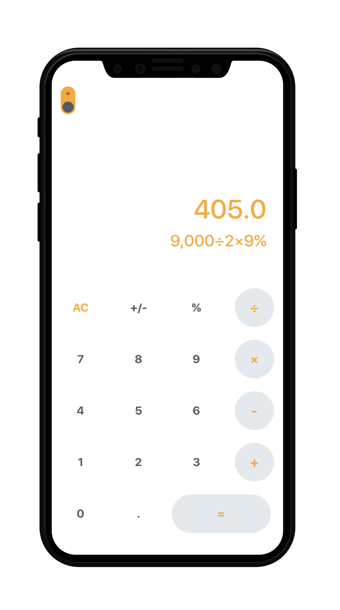
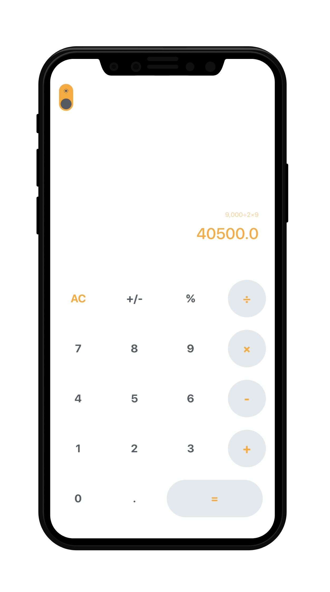
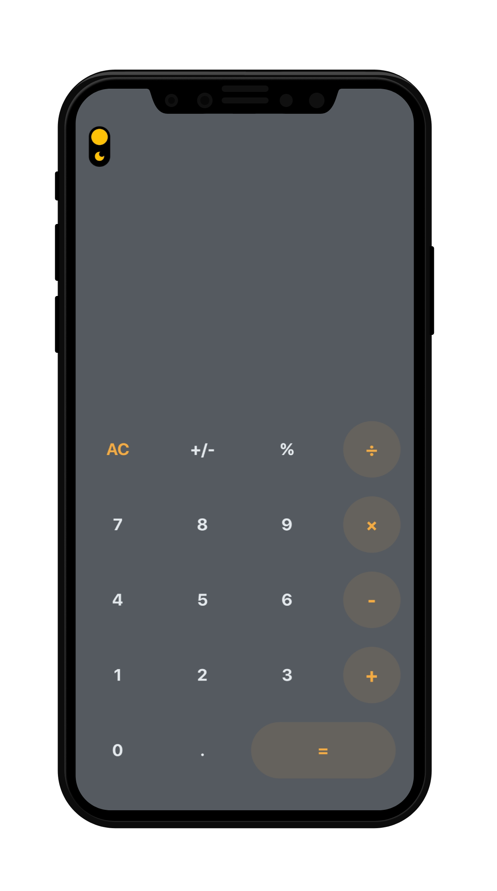
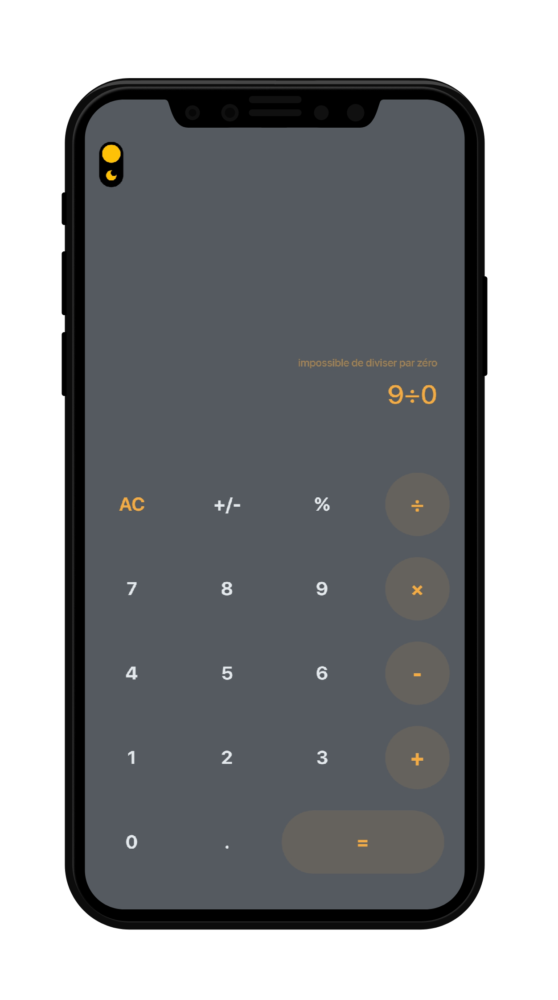
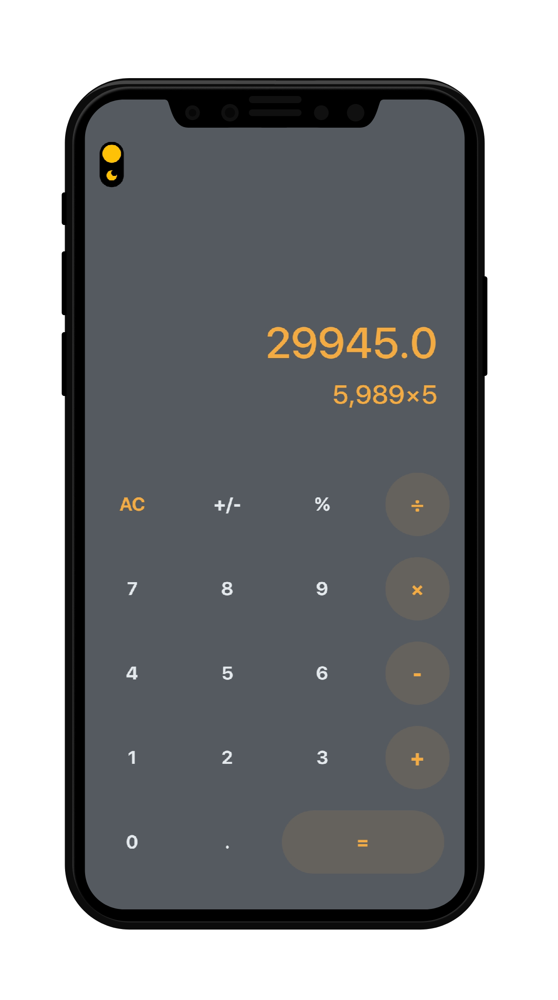

# calculator

   

A simple calculator with basic features for the _#7SEVENDAYSCHALLENGE_ enhanced by **DevChap**

## Getting Started :rocket:

- Clone the repo
- Install the dependencies
- Run it

> Note: You can download the attached release apk.

## Requirements :computer:

- Any Operating System (MacOS, Linux, Windows)
- Any IDE with Flutter SDK installed (Android Studio, VSCode etc)
- A little knowledge of Dart and Flutter

## Screenshots 📸

- Light Mode

|                |                         |                      |
|----------------|-------------------------------|-----------------------------|
|||            |

- Dark Mode

|                |                         |                      |
|----------------|-------------------------------|-----------------------------|
|||            |

## Todo
- Fix bug with addition operator
- Format the result with thousand separator

## About the #7SEVENDAYSCHALLENGE

  The challenge is to build an app using a free design chosen on dribble, uplab or behance. Each app will follow a concept such as theming, glassmorphing, animations etc...
  We build two versions of each  app: The flutter version and the native android with kotlin version

## DEVCHAP

  We are a team of passionnate developers with amazing skills and technologies. We build for you perfect mobile app, web app, website and api quickly as possible.
  [learn more about us](DEVCHAP_README.md)